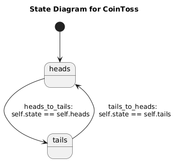
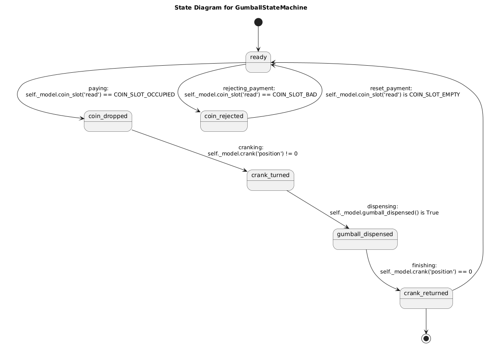

# lean-statemachine
A simple and lean state machine implementation.  With observer callbacks, transitions and events.

## Introduction
This state machine package is a stripped-down framework for implementing state machines in Python.  It is designed to be simple and easy to use, with a minimum of overhead, a lightweight implementation that can be easily integrated into other projects.

The package provides a `StateMachine` class that you subclass to create a state machine.  The subclass defines the `State`s, and `Transition`s between `State`s, that the machine can make.  You define callbacks on the subclass, which are called at various events and phases as the machine progresses through the lifecycle you have defined.  Once instantiated, you'll externally prompt the machine cycle through states. The machine will call the appropriate callbacks to determine which will be the next state.  Stepping from one state to another is a transition.  You may define a graph of states that has multiple branches and endpoints, with travel along the branches controlled by the transitions and their qualifying condition functions that you define.

Here is an example of a state machine that represents a door with a lock.  The door can be in one of three states: open, closed, or locked.  The door can be opened, closed, or locked, and the state machine will transition between the states as the door is manipulated.


```python

## Installation
The package can be installed using pip:
```bash
$ pip install lean@git+https://github.com/Kevin-Prichard/lean-statemachine
```

## Usage
To create a state machine, subclass the `StateMachine` class and define the states and transitions that the machine can make.  You can define callbacks that are called when the machine enters or exits a state, or when a transition is made.  You can also define callbacks that are called when the machine is in a state, or when a transition is being considered.

```python
from lean import StateMachine, State

class CoinToss(StateMachine):
    def __init__(self):
        super().__init__()

    heads = State('heads', initial=True)
    tails = State('tails')

    heads_to_tails = heads.to(tails, cond="is_heads")
    tails_to_heads = tails.to(heads, cond="is_tails")

    def is_heads(self):
        return self.state == self.heads

    def is_tails(self):
        return self.state == self.tails

    def on_enter_heads(self):
        print('Heads!')

    def on_enter_tails(self):
        print('Tails!')
```

Running this state machine through graph.py produces the following diagram-

```bash
$ ./graph.py -s examples/coin_flip.py -c CoinToss -m examples.coin_flip -o docs/coin_flip.png
```




## Additional examples
For examples, see the examples folder.  Currently two example state machines are available-

examples/gumball_machine.py
examples/door.py

In the GumballStateMachine example, we have a hardware API simulation layer called GumballMachineHardware, which provides a hardware control context / reference to an API external to the state machine subclass.  This allows callbacks to query physical state in order to prompt state change in the state machine, as well as activate API and/or hardware features in response to the state machine's events and changing state.

This keeps intact the boundary between state machines' internal state tracking, and the actual implementation of the processes and/or physical machines that they represent.


